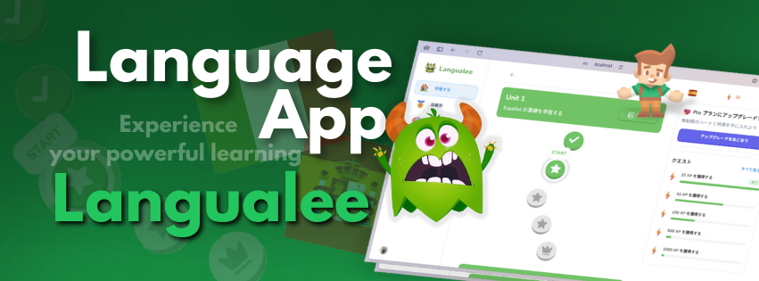
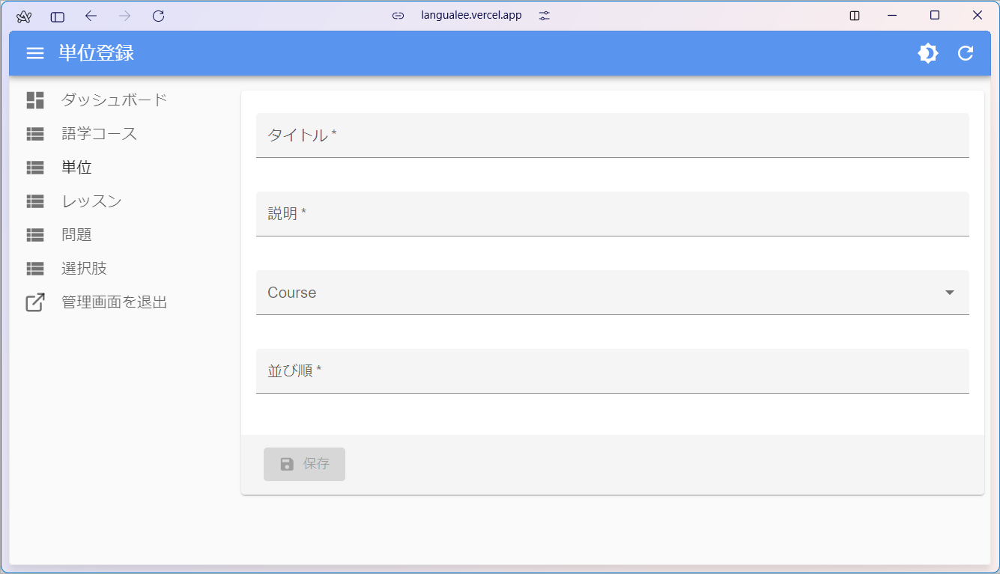

<div align="center">
  <div>
    
    
    
    
    
    
    
    
    
    
    
    
    
  </div>

  <h3 align="center">Language Learning App</h3>

  <div align="center">
    ゲームのように学習を旅する語学アプリ
  </div>
</div>

## 📋 <a name="table">もくじ</a>

1. 🤖 [はじめに](#intro)
2. 🔗 [URL](#url)
3. 💻 [画面一覧](#screen_list)
4. 🚀 [アプリの利用サンプル](#example)
5. 🤸 [終わりに](#outro)

## <a name="intro">🤖 はじめに</a>

あなたの学習をパワフルにする語学アプリ、Langualee を紹介します。

ゲーム感覚で繰り返し、単語や文章、発音になじんでいくことで、外国語を身に着けていくことができるアプリです。

## <a name="url">🔗 URL</a>

Langualee | Language Learning Adventures   
https://langualee.vercel.app

## <a name="screen_list">💻 画面一覧</a>

```
Langualee  
　│     
　├─　ランディングページ  
　│  
　├─　ログイン関連  
　│　　　　ログインモーダル  
　│　　　　アカウント作成モーダル  
　│　　　　ログアウト  
　│  
　├─　語学コース選択ページ  
　│  
　├─　学習ページ（学習の道のり） 
　│   　├─　プロフィール更新ページ 
　│     └─　レッスンクリアページ  
　│  
　├─　成績表ページ
　│  
　├─　クエスト一覧ページ
　│  
　├─　ショップページ 
　│  
　└─　管理画面  
```

### ログイン不要画面

#### ランディングページ 

|未ログインの場合|ログイン済みの場合 |
|---|---|
|||

### ログイン関連

```
ログイン関連  
　　ログインモーダル  
　　アカウント作成モーダル  
    ログアウト  
```

|ログインモーダル|アカウント作成モーダル |
|---|---|
|||

#### ログアウト

##### ユーザアバターをクリックしてメニューからログアウト


### 各ページ（ログイン後）

```
語学コース選択ページ 

学習ページ（学習の道のり） 
  │  
  └─　レッスンページ  
　    　├─　退出モーダル
　      └─　練習モードモーダル 

成績表ページ

クエスト一覧ページ

ショップページ 
```

##### 語学コース選択ページ  


#### 学習ページ（学習の道のり）  


#### レッスンページ  


|退出モーダル|練習モードモーダル |
|---|---|
|||

#### 成績表ページ 


##### クエスト一覧ページ


#### ショップページ  


### 管理画面

```
管理画面 
  ├─　語学コース一覧
　│   　├─　語学コース更新・削除
　│     └─　語学コース登録 
  │  
  ├─　単位一覧
　│   　├─　単位更新・削除
　│     └─　単位登録 
  │  
  ├─　レッスン一覧
　│   　├─　レッスン更新・削除
　│     └─　レッスン登録 
  │  
  ├─　問題一覧
　│   　├─　問題更新・削除
　│     └─　問題登録 
  │  
  ├─　選択肢一覧
　│   　├─　選択肢更新・削除
　│     └─　選択肢登録 
  │  
  └─　管理画面を退出  
```

#### 語学コースの管理  

|語学コース一覧|語学コース更新・削除|語学コース登録|
|---|---|---|
||||

#### 単位の管理 

|単位一覧|単位更新・削除|単位登録|
|---|---|---|
||||

#### レッスンの管理  

|レッスン一覧|レッスン更新・削除|レッスン登録|
|---|---|---|
||||

#### 出題の管理  

|出題一覧|出題更新・削除|出題登録|
|---|---|---|
||||

#### 選択肢の管理 

|選択肢一覧|選択肢更新・削除|選択肢登録|
|---|---|---|
||||

## <a name="example">アプリの利用サンプル</a>

### Langualee 操作デモ

#### 基本ルール

最初に与えられるハートは５、経験値（XP）は０。レッスンで出題される問題に、正解すると XP が１０ポイント増え、間違えるとハートが１つ減る。

ショップで XP と交換にハートを回復できるが、ハートは5以上には増えない。

まとめ
```
・最初に与えられるポイント：経験値（XP）０、ハート５
・レッスンでの出題に正解：XP が１０ポイントアップ
・レッスンでの出題に不正解：ハートが１つ減る
・ショップで XP １０ポイントと交換してハートを５まで回復することができる
・ハートは５以上には増えない
```

#### コースの選択

ログイン、コースの選択、学習ページの確認、ログアウトを行なう。

初めてログインした時は、コースが選択されていないので、学習ページは見られず、コースの選択画面に飛ばされる。

学習したい言語（コース）を選択すると、学習ページに

<!-- ./movies/langualee_select_course.mp4 -->
<video src="https://github.com/user-attachments/assets/afa89cf2-cc2d-4933-8c90-a8106b140ba6" controls="true"></video>

まとめ
```
・最初にログインすると、学習言語の選択（コース選択）ページに飛ぶ
・学習ページには学習のみちのりがフローで表示されている
```

学習の道のりに表示される学習内容の構造（例）は以下の通り：
```
単位１（タイトルバー）
　    　├─✅ レッスン１名詞（クリア済み）
　    　├─🌟💬 レッスン２動詞（受講中）
　      └─👑 レッスン３形容詞

単位２（タイトルバー）
　    　├─🌟 レッスン４慣用句
　    　├─🌟 レッスン５フレーズ
　      └─👑 レッスン６文章
```

#### レッスン実行

表示されている、学習の道のりの１つの丸が１つのレッスンです。

レッスンをクリックすると、レッスンが始まります。１つのレッスンには、いくつかの出題（チャレンジ）があります。
レッスン内のすべての出題をクリアすると、そのレッスンは終了です。

出題中でも、レッスンは途中退出することができ、
退出した後、学習の道のりで途中退出したレッスンを見ると、学習進捗が円グラフの状態で確認することができます。

<!-- ./movies/langualee_lesson.mp4 -->
<video src="https://github.com/user-attachments/assets/9d8552df-88cb-452e-abbb-f0b0b437cd0a" controls="true"></video>

まとめ
```
・学習の道のりに表示されている丸（レッスン）をクリックすると、レッスンが始まる
・１つのレッスンには複数の出題（チャレンジ）がある
・レッスンは途中退出することができる
・途中退出したレッスンを学習ページで見ると、進捗が円グラフ状で表示される
```

レッスンの構造（例）は以下の通り：
```
単位１
　└─ レッスン１名詞
        ├─ 出題１：次のうち、どれが「男」ですか？
        ├─ 出題２：発音している言葉を選択「男」
        ├─ 出題３：次のうち、どれが「女」ですか？
        └─ 出題４：次のうち、どれが「男の子」ですか？
```

#### XP によるハートの回復

出題に対して不正解を続きハートが０になると、出題に回答できなくなります。

しかし、出題を正解して XP のポイントがあると、ハートの回復ができます。XP１０ポイントでハートが最高の５に回復できます。

<!-- ./movies/langualee_refill_hearts.mp4 -->
<video src="https://github.com/user-attachments/assets/2b1b325b-aaf1-4a89-a76d-24f1c71db7e5" controls="true"></video>

まとめ
```
・出題に対して不正解を続くとハートが０になる
・ハートが０の状態では、出題に回答できない
・XP１０ポイントを使うと、ハートが最高の５に回復させることができる
```

#### 練習モード

一度クリアしたレッスンは、練習モードで復習をすることができます。
クリアしたレッスンを再実施する際は、必ず練習モードになります。

練習モードでは、不正解になってもハートが減りません。

<!-- ./movies/langualee_practice_mode.mp4 -->
<video src="https://github.com/user-attachments/assets/3a9fb8d4-f7f7-4663-a127-38bdcaa53e4a" controls="true"></video>

まとめ
```
・クリアしたレッスンを再実施する際は、必ず練習モードになる
・練習モードでは、不正解になってもハートが減らない
```

#### サブスクリプション

ハートが減っていくのを気にせずアプリを楽しみたい場合は、1か月ごとのサブスクリプションが使える。

サブスクリプションを使うと、ハートが無制限になり、出題された問題に間違えてもハートが減ることがない。

カード決済で手軽にサブスクリプションを行うことができる。
現状のカード決済はテストモードになっていて、ダミーのカード番号を入力することで
疑似的に決済を完了させることができる。

サブスクリプションはいつでも解約ができるが、解約をしない限り毎月カード決済がおこなわれ課金される。

<!-- ./movies/langualee_subscription.mp4 -->
<video src="https://github.com/user-attachments/assets/27d98df4-41bb-417e-87ba-1ba4e64e0206" controls="true"></video>

まとめ
```
・サブスクリプションを使うと、ハートが無制限になる
・ページからのカード決済で、その場でサブスクリプションを完了できる
・現状のカード決済機能はテストモード
・テスト用のダミーカード番号を入力することで、決済が完了できる
・サブスクリプションはいつでも解約できる
・サブスクリプションは解約しない限り、毎月カード決済がおこなわれる
```

## <a name="outro">🤸 おわりに</a>

ゲーム感覚で習慣化して外国語を訓練する、語学アプリ Langualee を紹介しました。

管理者の機能も揃えているので、実際に出題データを登録していけば、実際に語学訓練ができるアプリになります。
